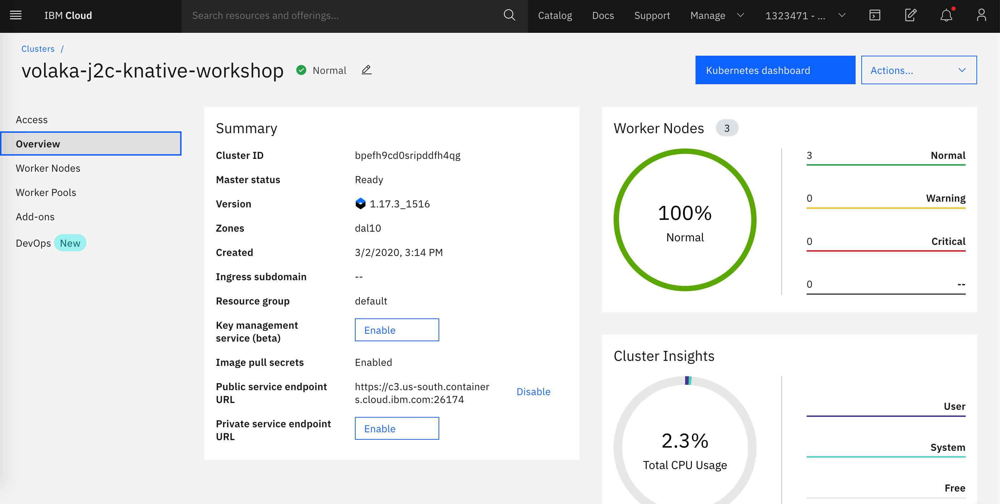
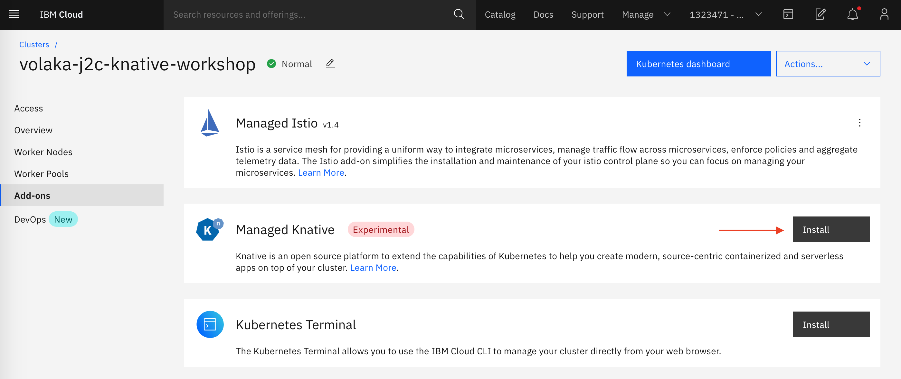

# Install Istio and Knative on Your Cluster

Knative is currently built on top of both Kubernetes and Istio. If you want to learn more about Kubernetes or Istio, you can check out the labs [Kube101](https://github.com/IBM/kube101/tree/master/workshop) and [Istio101](https://github.com/IBM/istio101/tree/master/workshop). When you install Knative on IKS, it will install Istio for you automatically.

## Install Knative

### Install from the CLI

1. \(Optional\) To install Knative, first make sure you have the latest Kubernetes plugin:

   ```text
    ibmcloud plugin update
   ```

2. Next ask for Knative to be installed:

   ```text
    ibmcloud ks cluster addon enable knative --cluster $MYCLUSTER
   ```

   You will be prompted to install Istio - when you see this prompt, enter `y`.

### Install from the GUI

1. Open you IKS Service Page
2. Go to "Add-Ons" tab from the right menu
3. Click to install button near "Managed Knative"
4. Click install on pop-up window.





### Control if KNative is installed successfully 

1. The install process may take a minute or two. To know when it's done you can run two commands - first see if the Istio and Knative namespaces are there:

   ```text
   kubectl get namespace
   ```

   and you should see something like:

   ```text
   NAME               STATUS   AGE
   default            Active   5h13m
   ibm-cert-store     Active   5h8m
   ibm-operators      Active   5h8m
   ibm-system         Active   5h11m
   istio-system       Active   4h48m
   knative-eventing   Active   4h48m
   knative-serving    Active   4h48m
   knative-sources    Active   4h48m
   kube-node-lease    Active   5h13m
   kube-public        Active   5h13m
   kube-system        Active   5h13m
   tekton-pipelines   Active   4h48m
   ```

   Notice the `istio-system` namespace, and the `knative-...` namespaces.

   Once the namespaces are there, check to see if all of the Istio and Knative pods are running correctly:

   ```text
   kubectl get pods --namespace istio-system
   kubectl get pods --namespace knative-serving
   kubectl get pods --namespace tekton-pipelines
   ```

   You could check the pods in all of the Knative namespaces, but for this workshop only "serving" and "build" are required.

Example Ouput:

```text
NAME                                      READY   STATUS    RESTARTS   AGE
cluster-local-gateway-dc7ff5449-k67kz     1/1     Running   0          4h52m
grafana-76ffd9945b-m2qt8                  1/1     Running   0          4h51m
istio-citadel-587cd77cc-h4pnr             1/1     Running   0          4h51m
istio-egressgateway-7c54c447-9mmx9        1/1     Running   0          4h51m
istio-egressgateway-7c54c447-ltnzt        1/1     Running   0          4h51m
istio-galley-7bf89c86c5-s67gb             2/2     Running   0          4h51m
istio-ingressgateway-6564db8495-4nxt8     1/1     Running   0          4h51m
istio-ingressgateway-6564db8495-k595h     1/1     Running   0          4h51m
istio-pilot-7459856c9b-w8pcr              2/2     Running   0          4h51m
istio-policy-54795d8f94-922qb             2/2     Running   1          4h51m
istio-sidecar-injector-75f845bbb9-gqwfx   1/1     Running   0          4h51m
istio-telemetry-6f9f766c8-qmfzd           2/2     Running   0          4h51m
istio-tracing-6db4f976bb-n8cct            1/1     Running   0          4h51m
kiali-86456d854f-xj7jh                    1/1     Running   0          4h51m
prometheus-db655d779-j7l9d                1/1     Running   0          4h51m
NAME                                READY   STATUS    RESTARTS   AGE
activator-785dd6f98b-w7wbn          2/2     Running   0          4h45m
autoscaler-7d8dc65584-xl6ss         2/2     Running   0          4h45m
autoscaler-hpa-6cfbdcc99c-6hldb     2/2     Running   2          4h45m
controller-7865b5fd46-6rqhn         2/2     Running   2          4h45m
networking-istio-7cd6c4cb68-4zwhc   1/1     Running   0          4h45m
webhook-7f4f6d9b64-p5xcs            2/2     Running   2          4h45m
NAME                                           READY   STATUS    RESTARTS   AGE
tekton-pipelines-controller-776fbbb699-6thtg   1/1     Running   0          4h45m
tekton-pipelines-webhook-6899b64fc8-lsgkt      1/1     Running   0          4h45m
```

If all of the pods shown are in a `Running` or `Completed` state then you should be all set.

Continue on to [exercise 3](exercise-3.md).

